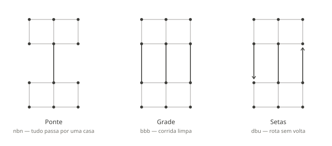

# Inversão

Um jogo de tabuleiro abstrato para dois jogadores, **resolvido por busca exaustiva antes de
existir como jogo**.

Cada jogador tem três peças — círculo, triângulo e quadrado — que precisam atravessar um
tabuleiro de doze casas e chegar ao encaixe do seu símbolo do outro lado. Nenhuma peça termina
na coluna em que começou. Não há captura, não há salto.

A regra que define o jogo é quem decide qual peça se move. Na mecânica padrão, sorteia-se a
iniciativa a cada rodada: quem a tem nomeia um símbolo e move a sua peça daquele símbolo — e o
adversário fica **obrigado a mover a peça do mesmo símbolo**. Metade do tempo, portanto, é o
adversário que escolhe qual das suas peças vai sair do lugar.



## Por que isso importa

Um jogo de travessia sem captura empata sozinho. Se vencer exige ocupar casas dentro da
posição inicial do adversário e nada obriga uma peça a se mover, o defensor estaciona uma peça
em casa e nunca mais a toca. Isso não depende do desenho do tabuleiro — mediram-se 90%, 92% e
97% de empates em três topologias diferentes antes de ficar claro que o defeito não estava no
caminho, estava no destino.

O que resolve é **movimento forçado**, e a mecânica padrão faz isso da forma mais barata
possível: o adversário vira o executor da regra. Se você parquear uma peça em casa, ele nomeia
justamente ela.

| mecânica | quem decide a peça | empates |
|---|---|---|
| **Escolha Sorteada** | quem tem a iniciativa nomeia; o outro responde com o mesmo símbolo | 0,025% – 2,6% |
| **Rodízio** | ninguém: ordem fixa e cíclica | 2,4% – 12,9% |

A escala inteira sai de uma linha de regra. Deixar o jogador nomear a peça **de forma
previsível**, alternando, leva os empates a **99,7%** — o defensor recupera o poder de
desfazer, e move a peça bloqueadora de ida e volta obedecendo à regra. Sortear a iniciativa
quebra isso, porque existe sempre a chance de o adversário escolher duas vezes seguidas e
arrastar a bloqueadora para longe. **O bloqueio deixa de ser estratégia e vira aposta.**

## O que está verificado

- **1.330.560 posições** no espaço de estados do Rodízio, resolvidas por análise retrógrada;
  vitória forçada de quem abre, a **283 lances** de profundidade
- **P(azul vence) = 0,5 exato** na Escolha Sorteada, e isso é *demonstrável* por simetria de
  rotação de 180°, não medido — os limites numéricos servem para confirmar a prova, não para
  descobri-la
- **A massa de empate é a única métrica que separa os três tabuleiros**, e separa por duas
  ordens de grandeza: 0,025% no Grade contra 2,61% na Ponte
- **Três implementações independentes** concordando: o solucionador em C reproduziu os números
  obtidos antes em Python, e um gerador de oráculos escrito à parte reproduz o perft lance a
  lance

Tudo acima sai das ferramentas deste repositório e é reproduzível com um `make`.

## Estado

**Jogável, contra a IA ou em dois no mesmo aparelho.** O motor está pronto e verificado
contra a implementação em C nas cinco combinações de mecânica e tabuleiro; a interface toca
as duas mecânicas, com navegação por teclado, modo sem cor, dial de velocidade e som.

**Instalável e offline.** O jogo inteiro é código — nada é buscado durante a partida —, então
o service worker só precisa conseguir abrir a página, e fecha a aba sem perder o jogo: a
partida em andamento volta rejogada pelo motor a partir da lista de ações, não de uma posição
guardada.

**E tem puzzle diário.** Três por dia, um de cada tabuleiro, iguais para todo mundo — a data
UTC é a única entrada, sem servidor e sem requisição. Cada um é uma partida de verdade a
partir de uma posição tirada da tabela, e errar não devolve "errado": devolve **quanto custou**
em pontos de probabilidade de vitória. Quase nenhum jogo consegue dizer isso.

**E foi jogado.** Era a pendência mais importante do projeto e a única não computável — toda
a análise provava que o jogo não estava quebrado, não que valesse a pena. Testado com
pessoas, ele se sustenta. As partidas terminaram entre **119 e 164 ações**, e não nos vinte
lances que fariam o erro ser decisivo cedo demais.

Falta o que está nos passos 8 e 9 da seção 11 do projeto: os **cards compartilháveis** — que
esperam a paleta definitiva, por serem imagem — e o **multiplayer por código**. A anotação
pós-jogo, que é o conteúdo do card, já está pronta.

## Estrutura

```
docs/     especificacao.md — as regras, os tabuleiros, os resultados
          projeto.md       — arquitetura do site, entrega, decisões
src/      engine/          — o jogo, em TypeScript puro: sem React, sem I/O
          ui/              — o tabuleiro e o que o cerca
public/   manifest.webmanifest, sw.js, _headers e os ícones
tests/    espelha src/, mais os testes contra os oráculos em C
tools/    quatro programas em C que geram os artefatos, mais o Makefile
          icons.mjs        — desenha os ícones do app, sem biblioteca de imagem
data/     oraculos.json    — fixture de verificação do motor
          puzzles.json     — 1.098 puzzles, um ano de desafios
```

```
npm install && npm test     # 471 testes
npm run dev                 # joga
npm run build               # site estático em dist/
```

As tabelas de solução não são versionadas: somam mais de 200 MB contando o estado de
convergência, e saem do C em minutos.

**Convenção de idioma:** o código é em inglês; português fica no que o usuário lê — interface,
conteúdo das páginas e estes documentos.

## Rodando as ferramentas

```
cd tools
make                 # compila os quatro programas
make oraculos.json   # segundos — valide o motor contra ele antes de tudo
make tabelas         # ~90 s por tabuleiro; a Ponte leva o dobro
make puzzles.json
```

O solucionador da Escolha Sorteada usa iteração de valor e precisa de milhares de sweeps —
1745 no Grade, 3599 na Ponte. O `SWEEPS ?= 4000` do Makefile cobre os dois numa passada; se
não cobrisse, ele salva o progresso e continua de onde parou. Os acumuladores são `double`
por necessidade — em `float` de 32 bits o alvo de convergência é inatingível por construção,
e a mensagem de
"convergiu" passaria a significar estagnação. Detalhes na seção 2.7 de
[docs/projeto.md](docs/projeto.md).

## Publicando

O site é construído pela Cloudflare a partir do repositório, e as tabelas
**não são versionadas** — são geradas no próprio build:

```
cd tools && make publica && cd .. && npm run build
```

`make publica` existe separado de `make dist` por um motivo que custa sete
minutos: `dist` pede `puzzles.json` como *alvo*, e esse alvo depende dos limites
superiores, que são `FORCE`. Num clone limpo isso dispara a convergência dos
três `hi` inteiros para reproduzir um arquivo que já está versionado e não
mudou. O `publica` copia os dois JSON como arquivos e gera só as cinco tabelas
que o site consome.

O mesmo comando serve para rodar localmente antes de um `npm run preview`.

Publicado como **Worker com arquivos estáticos**, configurado em
`wrangler.jsonc`. Não há `main` ali, e é de propósito: o jogo inteiro roda no
navegador, então não existe código de servidor nenhum para declarar.

No painel, o *Root directory* é a **raiz do repositório**, não `dist` — `dist`
é a saída, e não existe no clone.

Qualquer endereço desconhecido é servido como o `index.html`, pelo
`not_found_handling` do `wrangler.jsonc`: `/desafios` e `/regras` são o mesmo
documento, e sem isso um link compartilhado daria 404 em acesso direto.

**Não use um `_redirects` para isso.** A regra `/* /index.html 200` que o Pages
aceitava é recusada pelo Workers, que normaliza `/index.html` de volta para `/`
e detecta o laço. Há teste impedindo o arquivo de voltar.

Um arquivo ainda viaja dentro do `dist/` e é contrato com o host: o `_headers`,
que diz o que guardar. A regra que mais importa é `/sw.js` com `no-cache` — um
service worker guardado no cache HTTP continua decidindo o que toda visita
futura recebe, e recarregar não o substitui.

Sem as tabelas o jogo funciona, mas cai para a IA de busca e perde os níveis
calibrados, o *Insano* e o *Impossível*.

## Leitura

- **[docs/especificacao.md](docs/especificacao.md)** — o jogo: regras, tabuleiros, mecânicas,
  resultados da análise, e o registro do que foi testado e descartado com o motivo de cada
  descarte
- **[docs/projeto.md](docs/projeto.md)** — o site: arquitetura, formato binário das tabelas,
  oráculos de verificação, ordem de construção
