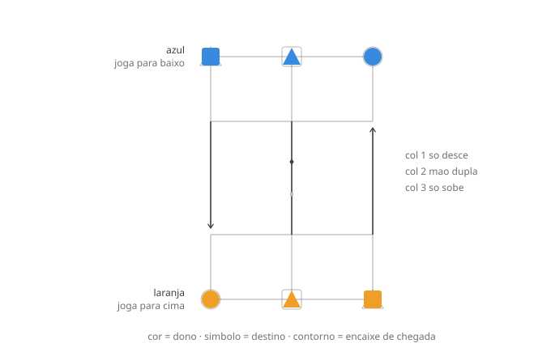
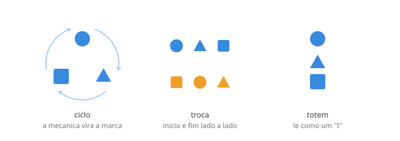

# Inversão — Especificação do Jogo

Jogo de tabuleiro abstrato para dois jogadores. Cada um tem três peças que precisam
atravessar o tabuleiro **e trocar de coluna**, num tabuleiro pequeno de doze casas.

Esta especificação é o resultado de uma análise exaustiva por computador: o espaço de
estados foi resolvido por completo em todas as combinações de regra e tabuleiro descritas
aqui. As variantes descartadas estão na seção 8, com o motivo.

**Estrutura do jogo:** duas mecânicas × três tabuleiros. A mecânica define quem decide
qual peça se move; o tabuleiro define por onde se atravessa. Tudo o mais — peças, alvos,
condição de vitória — é comum a todas as combinações.

---

## 1. Tabuleiros


Os três são grades de **4 linhas × 3 colunas**, 12 casas numeradas 0–11. **A única
diferença entre eles é a faixa central** — as três ligações que cruzam o meio do tabuleiro.

```
        col 1   col 2   col 3
lin A  [  0  ] [  1  ] [  2  ]      fileira inicial do AZUL
lin B  [  3  ] [  4  ] [  5  ]
         3-6     4-7     5-8        <- faixa central: varia por tabuleiro
lin C  [  6  ] [  7  ] [  8  ]
lin D  [  9  ] [ 10  ] [ 11  ]      fileira inicial do LARANJA
```

Nomes legíveis: `A1 A2 A3 / B1 B2 B3 / C1 C2 C3 / D1 D2 D3`.

### 1.1 Ligações comuns a todos os tabuleiros

Catorze arestas de mão dupla, presentes nos três:

| tipo | arestas |
|---|---|
| horizontais | 0↔1, 1↔2, 3↔4, 4↔5, 6↔7, 7↔8, 9↔10, 10↔11 |
| verticais (bloco de cima) | 0↔3, 1↔4, 2↔5 |
| verticais (bloco de baixo) | 6↔9, 7↔10, 8↔11 |

### 1.2 A faixa central define o tabuleiro

| tabuleiro | código | 3–6 (col 1) | 4–7 (col 2) | 5–8 (col 3) |
|---|---|---|---|---|
| **Ponte** | `nbn` | — | mão dupla | — |
| **Grade** | `bbb` | mão dupla | mão dupla | mão dupla |
| **Setas** | `dbu` | 3 → 6 só desce | mão dupla | 8 → 5 só sobe |

O código de três letras (`n` nenhuma, `b` mão dupla, `d` só desce, `u` só sobe) é a forma
compacta de identificar o tabuleiro no código e nos nomes de arquivo das tabelas.

O caráter de cada um, em uma linha:

- **Ponte** — toda a travessia passa por uma casa. Tensão concentrada, a passagem é recurso escasso.
- **Grade** — sem gargalo e sem restrição de sentido. Corrida limpa.
- **Setas** — descer pela esquerda e subir pela direita são caminhos sem volta. Planejamento de rota.

### 1.3 Listas de adjacência — fonte de verdade para implementação

**Ponte (`nbn`)**
```
 0 -> 1, 3        6 -> 7, 9
 1 -> 0, 2, 4     7 -> 4, 6, 8, 10
 2 -> 1, 5        8 -> 7, 11
 3 -> 0, 4        9 -> 6, 10
 4 -> 1, 3, 5, 7 10 -> 7, 9, 11
 5 -> 2, 4       11 -> 8, 10
```

**Grade (`bbb`)**
```
 0 -> 1, 3        6 -> 3, 7, 9
 1 -> 0, 2, 4     7 -> 4, 6, 8, 10
 2 -> 1, 5        8 -> 5, 7, 11
 3 -> 0, 4, 6     9 -> 6, 10
 4 -> 1, 3, 5, 7 10 -> 7, 9, 11
 5 -> 2, 4, 8    11 -> 8, 10
```

**Setas (`dbu`)**
```
 0 -> 1, 3        6 -> 7, 9          <- 6 NAO liga de volta a 3
 1 -> 0, 2, 4     7 -> 4, 6, 8, 10
 2 -> 1, 5        8 -> 5, 7, 11      <- 5 e a passagem de subida
 3 -> 0, 4, 6     9 -> 6, 10            (col 3)
 4 -> 1, 3, 5, 7 10 -> 7, 9, 11
 5 -> 2, 4       11 -> 8, 10
```

No tabuleiro Setas as duas únicas assimetrias são: `3 → 6` existe mas `6 → 3` não;
`8 → 5` existe mas `5 → 8` não.

### 1.4 A orientação das setas importa — mas só no rodízio

No modo Rodízio (seção 4.2), o arranjo espelhado (col 1 sobe, col 3 desce) produz **empate
forçado em todas as aberturas**, enquanto `↓ ↕ ↑` produz jogo decidido. Os dois são
equivalentes por rotação de 180°, logo ambos são justos — a diferença está em qual jogador
recebe a coluna de descida do próprio lado, o que muda quem ganha o tempo na primeira
travessia. Não há como prever isso olhando o desenho.

No modo Escolha Sorteada (seção 4.1) as duas orientações são equilibradas e a escolha passa
a ser estética.

O mesmo vale para a escolha entre Grade e Setas: sob Escolha Sorteada os dois são
equivalentes em equilíbrio; sob Rodízio o Grade é estritamente mais afiado (seção 4.2).

---

## 2. Peças e linguagem visual

Cada jogador tem **três peças**. Duas dimensões visuais independentes, e nunca as
misture:

| canal | codifica | valores |
|---|---|---|
| **cor** | de quem é a peça | azul / laranja |
| **símbolo** | para onde ela vai | círculo / triângulo / quadrado |

Cor é o canal perceptivo mais forte e deve carregar aquilo que nunca pode ser
confundido — o dono. O destino é informação secundária e consultável, então vai para o
símbolo. Duas cores (em vez de três) também é muito mais seguro para daltonismo: azul e
laranja funcionam para praticamente todos os tipos.

**O símbolo também é o nome da peça.** No rodízio, "agora é a vez do quadrado" é mais
fácil de acompanhar do que "agora é a vez da peça 3". Use os símbolos na interface,
não os números — estes existem só para o código.

| peça (código) | símbolo | uso na interface |
|---|---|---|
| 1 | círculo | "círculo" |
| 2 | triângulo | "triângulo" |
| 3 | quadrado | "quadrado" |

### 2.1 Posições iniciais

| jogador | círculo | triângulo | quadrado |
|---|---|---|---|
| **AZUL** (linha A, joga para baixo) | A3 (casa 2) | A2 (casa 1) | A1 (casa 0) |
| **LARANJA** (linha D, joga para cima) | D1 (casa 9) | D2 (casa 10) | D3 (casa 11) |

### 2.2 Alvos — "ciclo B"

Cada peça precisa chegar à casa marcada com o **seu símbolo** na fileira oposta. O
mapeamento de colunas é um ciclo: **nenhuma peça termina na coluna em que começou.**

| jogador | círculo | triângulo | quadrado |
|---|---|---|---|
| **AZUL** | → D1 (casa 9) | → D3 (casa 11) | → D2 (casa 10) |
| **LARANJA** | → A3 (casa 2) | → A1 (casa 0) | → A2 (casa 1) |

Em colunas, para o AZUL: `col3→col1, col2→col3, col1→col2`. Para o LARANJA é o ciclo
inverso, por simetria de rotação de 180°.

### 2.3 Marcação dos alvos



Os alvos ficam nas fileiras extremas:

| casa | símbolo do alvo |
|---|---|
| A1 (0) | triângulo |
| A2 (1) | quadrado |
| A3 (2) | círculo |
| D1 (9) | círculo |
| D2 (10) | quadrado |
| D3 (11) | triângulo |

**Desenhe o alvo como contorno vazado, fino, nunca preenchido** — um "encaixe" com o
formato da peça que deve chegar ali. No início da partida os encaixes estão escondidos
sob as próprias peças e vão sendo revelados conforme elas saem. O fim de jogo é
literalmente preencher os encaixes.

Como o símbolo é etiqueta e não território, uma peça-triângulo parada sobre um encaixe
de quadrado não gera conflito visual — diferente do que aconteceria se a cor marcasse
destino.

**Destaque contextual.** Ilumine apenas a peça ativa e o encaixe dela — no Rodízio, a peça
que o ciclo determinou; na Escolha Sorteada, a peça nomeada na rodada. O tabuleiro fica
limpo e a informação aparece quando é necessária.

---

## 3. Regras

### 3.1 Lance

Um lance move **a peça ativa** para uma casa vizinha vazia, respeitando o sentido das
arestas. Não há captura, não há salto, não há empilhamento.

Qual peça está ativa é o que distingue as duas mecânicas (seção 4). O que nunca muda: **um
lance move uma peça, e só para uma casa vizinha vazia.**

### 3.2 Passe

Se a peça ativa não tiver nenhum lance legal, o jogador **perde a vez**. Não é permitido
mover outra peça no lugar. No Rodízio o ciclo avança normalmente; na Escolha Sorteada a
rodada segue para o adversário.

Essa situação é comum — entre 9% e 13% dos casos conforme o tabuleiro — e é a que mais gera
dúvida. Avise explicitamente na interface, senão o jogador acha que travou.

### 3.3 Vitória

Vence quem primeiro tiver **as três peças** simultaneamente nos seus encaixes
(seção 2.2). Verifique após cada lance, para o jogador que acabou de mover.

> **Armadilha de implementação — jogadas duplas.** Na Escolha Sorteada o mesmo jogador pode
> mover duas vezes seguidas: quando responde numa rodada e ganha a iniciativa na seguinte.
> A verificação de vitória por lance continua correta, mas **a análise retrógrada padrão
> não**: ela pressupõe alternância a cada lance, e com jogadas duplas os valores se propagam
> invertidos. O sintoma é a proporção de vitórias bater exatamente com a proporção de fases
> do estado, em vez de refletir a posição. A correção é rotular os estados de forma absoluta
> (azul vence / laranja vence) em vez de relativa ao jogador da vez.

### 3.4 Empate

Três formas. Duas valem sempre; a terceira é opcional e vem desligada.

**Por acordo.** Qualquer jogador pode propor empate; o outro aceita ou recusa. É a via
principal, e a mais natural entre dois humanos.

**Por repetição tripla — opcional, e desligada por padrão.** Mesmas casas ocupadas, mesmo
jogador da vez, mesmo estado do seletor, três vezes. O app consegue detectar, e rastrear
isso mentalmente seria inviável — mas conseguir não é motivo para impor.

Ela foi cortada do padrão por duas razões, e a primeira é a mais séria:

1. **Em jogo com acaso, repetição não é estagnação.** No xadrez a posição repetida prova
   que ninguém progride, porque as opções são as mesmas. Na Escolha Sorteada a posição pode
   voltar só porque os sorteios mandaram os dois fazerem coisas reversíveis, e quem está
   melhor pode legitimamente estar repetindo à espera de uma sequência de iniciativas
   favorável. Declarar empate ali tira do jogador um plano válido.
2. **No Rodízio ela dispararia sobre movimento forçado.** Em 54% dos turnos o jogador não
   decide nada — 42% com lance único e 11% com passe (seção 7.3). Um jogo tanto tempo nos
   trilhos volta à mesma posição sem que ninguém tenha escolhido repetir, e a regra leria
   isso como acordo tácito.

**O que garante que toda partida termina é o limite de lances**, não a repetição. Ela é
conveniência para quem quiser, não fundação — e por isso é uma caixinha na configuração da
partida.

**Por limite de lances.** Quem cria a partida define um teto de ações, no máximo 600.
Alcançado o teto sem ninguém completar as três peças, é empate — e o contador fica visível na
tela o tempo todo, porque é ele que garante que **toda partida termina**.

> **Por que 600 e não 500.** O teto tem que caber o jogo mais longo que o próprio
> solucionador prova. No Rodízio sobre o Grade, abrindo pelo quadrado, o segundo jogador tem
> vitória forçada em **524 lances** — com um teto de 500 o app declararia empate numa partida
> que ele mesmo sabe estar ganha, e o resultado no papel seria indemonstrável na tela. As
> outras aberturas do Grade custam menos (401 pelo triângulo, empate pelo círculo) e o Setas
> resolve em 283, mas o teto se mede pelo pior caso, não pelo típico.
>
> Isso é distância entre dois jogadores perfeitos. Partidas humanas terminaram entre 119 e
> 164 ações, então o padrão de 500 continua largo para quem joga de verdade — quem quiser ver
> a linha inteira sobe o teto.

> **Foi um cronômetro, e o cronômetro caiu.** A ideia era relógio por jogador, com a posição
> adjudicada pela tabela no fim do tempo — vitrine de algo que quase nenhum jogo pode fazer,
> por ter veredito exato em vez de heurística. Três problemas a derrubaram:
>
> 1. **Adjudicar premiava não jogar.** Quem estivesse à frente na posição venceria deixando o
>    relógio zerar, o que é o oposto do que o relógio individual existe para impedir.
> 2. **O resultado não é verificável pelo jogador.** "Você perdeu porque a tabela avalia sua
>    posição em 0,31" é análise, não desfecho. Ninguém aceita perder por um número que não
>    consegue conferir.
> 3. **Relógio nenhum garante o fim.** Quem joga rápido nunca fica sem tempo, e com incremento
>    o relógio até cresce. Só um teto de ações garante.
>
> A vitrine da tabela não se perde: ela vive na **anotação pós-jogo** (seção 7.1 do documento
> do projeto), apontando o lance em que a partida virou. Ali ela ensina em vez de arbitrar, e
> como não decide nada, ninguém tem motivo para manipulá-la.

No Rodízio, cerca de 13% das posições são empate teórico, então empates vão acontecer de
verdade. Na Escolha Sorteada a massa de empate é pequena mas não é nula — de 0,03% no Grade
a 2,6% na Ponte (seção 7.1) —, e o limite de lances é a garantia de que toda partida
termina.

**Contra a IA, o empate proposto ganha um comportamento especial:** como a tabela conhece o
valor exato da posição, a IA responde com conhecimento perfeito.

A dificuldade regula a **disposição a aceitar**, não a recusar. Recusar nunca é erro: numa
posição empatada a IA apenas segue jogando, e numa perdida só prolonga. O único erro que
custa resultado é aceitar empate estando ganhando.

| nível | aceita estando ganhando |
|---|---|
| Fácil | quase sempre |
| Médio | às vezes |
| Difícil | raramente |
| Impossível | nunca |

Nas posições empatadas ou perdidas, a IA aceita sempre, em qualquer nível.

Na Escolha Sorteada não existe "empatada" — o valor é contínuo. A regra vira: aceita quando
a probabilidade está próxima de 0,5, com a largura da faixa determinada pelo nível.

> **Cuidado — a resposta da IA é um oráculo.** No nível Impossível, recusar revela que a
> posição está ganha para ela; aceitar revela que está empatada. Propondo empate a cada
> lance, o jogador extrai uma avaliação exata de graça, e o recurso mais bonito do sistema
> vira a maior brecha dele.
>
> Duas travas, e use as duas:
>
> 1. **A IA só considera propostas com a partida estagnada** — por exemplo, após 15 a 20
>    lances sem que nenhuma peça se aproxime do seu encaixe. É a melhor mitigação porque
>    também é o comportamento mais natural: ninguém propõe empate no décimo lance de uma
>    posição viva.
> 2. **Tempo de recarga entre propostas** — no máximo uma a cada 10 lances.
>
> Uma terceira opção, descartada: pôr ruído na resposta em todos os níveis. Fecha o
> vazamento, mas destrói o que havia de interessante — a IA responder com conhecimento
> perfeito.

---

## 4. Mecânicas

As duas mecânicas compartilham tabuleiro, peças, alvos e condição de vitória. **A única
coisa que muda é quem decide qual peça se move.** No código isso é uma interface com duas
implementações, não dois jogos.

| | Escolha Sorteada | Rodízio |
|---|---|---|
| quem decide a peça | o jogador com a iniciativa | ninguém: ordem fixa |
| acaso | sorteio da iniciativa | nenhum |
| tabuleiros | os três | Grade e Setas |
| valor de uma posição | probabilidade | veredito exato |
| turnos com decisão real | ~96% | 46% |

### 4.1 Escolha Sorteada — mecânica padrão

1. **Antes de cada rodada, sorteia-se quem tem a iniciativa** (50/50).
2. Quem tem a iniciativa **nomeia um dos três símbolos** e move a sua peça daquele símbolo
   para uma casa vizinha vazia. Se ela não puder mover, passa.
3. O adversário é **obrigado a mover a peça do mesmo símbolo**, no destino que quiser. Se
   ela não puder mover, passa.
4. Nova rodada, novo sorteio.

Não há ciclo, não há contador, não há abertura fixa. **As regras são mais simples que as do
Rodízio**, porque o anti-estacionamento vem da própria mecânica: se você parquear uma peça
em casa, o adversário nomeia justamente ela e te obriga a mexer. O adversário vira o
executor da regra.

> **O acaso não escolhe a sua jogada — ele decide quem escolhe.** Essa distinção precisa
> ficar evidente na interface, porque a confusão entre as duas coisas é o que gera a
> sensação de jogo manipulado. Sortear iniciativa é comum em bons jogos; sortear a jogada do
> jogador é o que irrita.
>
> Na prática: o sorteio deve ser um **evento visível e claramente anterior à decisão** —
> animação curta anunciando "iniciativa: você", e só então o tabuleiro fica interativo.
> Acaso invisível, ou que pareça consequência da jogada anterior, é o que gera desconfiança.

**Jogadas duplas acontecem** e não são erro: quem responde numa rodada pode ganhar a
iniciativa na seguinte. Deixe explícito na interface.

### 4.2 Rodízio — mecânica alternativa

Ordem fixa e cíclica: círculo, triângulo, quadrado, círculo, ... O contador avança a cada
lance (inclusive nos passes) e é compartilhado: os dois jogadores percorrem o mesmo ciclo.
O jogador nunca escolhe qual peça mover, só para onde.

**Funciona nos tabuleiros Grade e Setas. Morre na Ponte** (34,7% de empates, todas as
aberturas empatadas — o gargalo é fatal quando não há sorteio para quebrar o bloqueio).

**O Grade é o padrão do Rodízio**, e é a combinação mais afiada do jogo inteiro: 2,4% de
empates contra 12,9% do Setas, e profundidades de 401 e 524 lances contra 283.

**A abertura é configurável, e no Grade ela é uma decisão real:**

| tabuleiro | círculo | triângulo | quadrado |
|---|---|---|---|
| **Grade** | empate | **azul vence em 401** | **laranja vence em 524** |
| **Setas** | empate | empate | **azul vence em 283** |

No Grade, a escolha da abertura decide **qual dos dois lados** tem a vitória teórica — o que
nenhum outro parâmetro do jogo faz. Dar essa escolha ao segundo jogador é uma regra da torta
natural, sem precisar inventar uma.

Esses vereditos valem só sob jogo perfeito por centenas de lances; entre dois humanos a
partida se decide por erro muito antes, e todas as aberturas são jogáveis. Nos níveis
"Impossível", onde o veredito teórico é o que está em jogo, fixe a abertura.

Informação perfeita, sem acaso. É a mecânica mais abstrata, e a única com veredito exato,
distância até o fim e níveis "Impossível" com sentido literal.

**O custo, medido:** ramificação média 1,45. Em 42% dos turnos existe um único lance legal e
em 11% nenhum — **54% dos turnos não são decisão.** Isso não é defeito corrigível; é o
mecanismo. Ver seção 8.3.

> **Recomendação de produto.** A raiz abre na Escolha Sorteada, tabuleiro Setas, contra a
> IA. Seletor de mecânica e de tabuleiro num painel discreto dentro do jogo, nunca numa tela
> anterior a ele. A primeira partida de um jogo desconhecido não deve começar com um menu de
> cinco combinações que o jogador ainda não tem como avaliar.

---

## 5. Identidade visual

O vocabulário de formas do jogo já serve de marca. Três direções, todas construídas com
círculo, triângulo e quadrado:



- **Ciclo** — as três formas em arranjo triangular, com setas curvas de rotação. É
  literalmente o ciclo B, a regra que define o jogo. O mais forte conceitualmente: quem
  joga entende a marca depois da primeira partida.
- **Troca** — duas fileiras de três formas, cores trocadas e ordem deslocada. O mais
  explicativo, mas seis elementos viram mancha em tamanho pequeno. Serve como ilustração
  de cabeçalho, não como marca.
- **Totem** — as três formas empilhadas na vertical. Lê quase como um "I". O mais
  versátil: funciona minúsculo, em uma cor só, e empilha bem como ícone de app.

**Combinação recomendada:** totem como ícone (favicon, app, avatar) e ciclo como marca
completa ao lado do nome. Mesmo vocabulário, lê como família.

*Cuidado técnico:* as setas do ciclo somem abaixo de ~48px. Para favicon, use o totem ou
a versão do ciclo sem setas — só as três formas em arranjo triangular, que ainda sugere
rotação.

Um logo precisa funcionar em uma cor só e a 32px. Cor por dono não sobrevive ao favicon;
símbolo por destino sobrevive. É mais um motivo para a divisão de canais da seção 2.

---

## 6. IA e níveis de dificuldade

As duas mecânicas foram resolvidas por completo. No Rodízio toda posição tem **veredito
exato** (vitória / derrota / empate) e distância até o fim. Na Escolha Sorteada o valor é
uma **probabilidade** — o que não impede tabela, apenas muda o que ela guarda. Como cada
tabela é construída está na seção 2.4 do documento do projeto; aqui fica o que o jogador
percebe.

**Na Escolha Sorteada o nível é uma tolerância a erro, em pontos percentuais.** Como se sabe
exatamente quanto cada lance custa, a calibragem é contínua em vez de categórica:

| nível | aceita lances que custam até |
|---|---|
| Fácil | 20 pontos percentuais |
| Médio | 10 |
| Difícil | 3 |
| Impossível | 0 |

**No Rodízio o nível é probabilidade de erro deliberado**, porque o valor é discreto:

| nível | erro |
|---|---|
| Fácil | ~30% dos lances |
| Médio | ~10% |
| Difícil | ~2% |
| Impossível | nunca |

Em ambos, "errar" deve ser **escolher o segundo melhor lance**, não jogar aleatoriamente —
isso produz um oponente que parece humano em vez de burro.

**Sem tabela, o nível vira profundidade de busca.** Vale enquanto a tabela do tabuleiro
escolhido não terminou de baixar. A ramificação do jogo é baixa (1,45 no Rodízio, ~4,7 para
quem escolhe na Escolha Sorteada), então a busca alcança profundidade alta a custo baixo e
joga bem — não é remendo.

**No Rodízio o nível máximo tem dois nomes, e qual deles você vê não é uma escolha sua:**

- **Improvável** — a vitória teórica é *sua*. A IA joga sem erro, mas a posição está ganha
  para quem abre, e derrotá-la é possível.
- **Insano** — a vitória teórica é *dela*. Não existe linha que ganhe. Nem empate existe.

Chamar de "Impossível" as duas era errado nos dois sentidos: uma delas é possível, e a outra
é bem mais do que difícil. O rótulo honesto transforma frustração em atrativo — quem perde
para o *Insano* perdeu para um teorema, e isso é uma coisa boa de se contar.

**O que decide qual dos dois aparece é a abertura**, não um botão:

| tabuleiro | abertura | vitória teórica de | rótulo |
|---|---|---|---|
| Setas | círculo | ninguém | jogo perfeito empata |
| Setas | triângulo | ninguém | jogo perfeito empata |
| Setas | quadrado | quem abre | **Improvável** |
| Grade | círculo | ninguém | jogo perfeito empata |
| Grade | triângulo | quem abre | **Improvável** |
| Grade | **quadrado** | quem responde | **Insano** |

Uma única combinação em seis é invencível, e ela é a que o Rodízio abre por padrão hoje:
Grade no quadrado. Vale decidir se é isso mesmo que se quer oferecer primeiro.

Na Escolha Sorteada não existe nível invencível em nenhum tabuleiro: a posição inicial é
~50/50 nos três, então o máximo continua sendo **Impossível** — sem erro, mas derrotável.

---

## 7. Resultados da análise

### 7.1 Escolha Sorteada — o valor é 0,5, e o empate é o que resta

**O valor da posição inicial é exatamente 0,5 nos três tabuleiros, e isso é demonstrável —
não medido.**

Prova: a rotação de 180° do tabuleiro (casa `i` → casa `11-i`) é uma simetria de todos os
três — ela leva cada aresta numa aresta existente, inclusive as dirigidas do Setas, onde
`3→6` vira `8→5`. Essa mesma rotação leva a posição inicial do azul exatamente na do laranja
e os alvos do azul exatamente nos do laranja. Como a iniciativa é sorteada 50/50 na raiz, os
dois lados são indistinguíveis. Logo P(azul vence) = 0,5.

**O que a iteração de valor mede, então, não é o valor — é a massa de empate.** `lo` converge
por baixo tratando jogo infinito como derrota do azul; `hi` por cima, tratando como vitória.
Os dois estacionam **separados**, e a largura entre eles é a fatia da probabilidade em que o
jogo não termina sob jogo ótimo. É resultado, não resíduo: ela sobrevive à convergência
completa.

| tabuleiro | código | `lo` | `hi` | largura | `lo` + `hi` |
|---|---|---|---|---|---|
| **Ponte** | `nbn` | 0,48696 | 0,51304 | 0,02608 | 1,00000 |
| **Grade** | `bbb` | 0,49988 | 0,50012 | 0,00024 | 1,00000 |
| **Setas** | `dbu` | 0,49365 | 0,50635 | 0,01270 | 1,00000 |
| 2 pontes laterais | `bnb` | 0,49980 | 0,50020 | 0,00040 | 1,00000 |
| Setas invertidas | `ubd` | 0,49355 | 0,50645 | 0,01290 | 1,00000 |

Gerados pelo `solver-sorteio` deste repositório, em `double`, todos até delta < 1e-9, sem
nenhum aviso de não-convergência.

**A coluna `lo` + `hi` é o teste.** A prova exige brackets simétricos em torno de 0,5, então
a soma tem de dar 1. Ela dá, nos cinco, até a quinta casa. Um solucionador com o bug de
rótulo relativo da seção 3.3 falharia esse teste de forma visível. Como `hi = 1 − lo` por
simetria, as duas colunas não são medições independentes — a largura é `1 − 2·lo`.

**A largura não encolhe com mais iteração — foi verificado.** Rodando em `double` 12.000
sweeps além do alvo de 1e-9, com os dois lados parando em delta exatamente zero, nem uma casa
decimal se moveu no Setas. Os dois limites são pontos fixos genuínos e distintos, e a
distância entre eles é propriedade do jogo.

**Então a Escolha Sorteada não elimina o empate — ela o reduz a poucos pontos percentuais, e
de forma muito desigual entre os tabuleiros.** Ler com cuidado: `hi − lo` é o intervalo entre
pontuar o jogo infinito como derrota e como vitória do azul, não literalmente a probabilidade
de empate. Ela limita essa probabilidade e dá a ordem de grandeza certa, mas não é igual a
ela.

A ordem que sai é exatamente a que a topologia prevê. **A Ponte, com toda a travessia passando
por uma casa, sustenta bloqueio: 2,6%.** O Setas corta isso pela metade, porque as colunas de
mão única impedem a peça bloqueadora de voltar. **O Grade, sem gargalo e sem sentido único,
quase não deixa o empate sobreviver: 0,025%, cem vezes menos que a Ponte.**

Isso importa além do número. A pendência da seção 9 pergunta se os três tabuleiros produzem
experiências distintas, e o perfil estrutural logo abaixo não os separa. **A massa de empate
separa**, por duas ordens de grandeza, e é a única métrica que separa. Se os três se
parecerem no teste com pessoas, é aqui que está a hipótese do porquê não deveriam.

*Nota de precisão, que também é armadilha:* isso **não pode** ser medido em `float` de 32
bits. Perto de 0,5 o menor incremento representável é ~6e-8, então `delta < 1e-9` só dispara
quando o delta é exatamente zero — a iteração estagna na resolução do tipo e se anuncia como
convergida. Os acumuladores do `solver-sorteio` são `double` por esse motivo.

Os dois últimos tabuleiros ficam guardados, já verificados, fora do lançamento.

Perfil estrutural dos três que entram:

| | Ponte | Grade | Setas |
|---|---|---|---|
| opções de quem escolhe | 4,49 | 4,92 | 4,71 |
| vantagem média do melhor lance | 0,017 | 0,015 | 0,015 |
| posições com escolha nítida (>10 pts) | 2,4% | 1,9% | 2,0% |
| peças sem lance legal | 13,4% | 9,3% | 11,4% |
| travessia mínima | 13 lances | 13 lances | 13 lances |

> **Leitura honesta desses números.** Eles medem estrutura, não sensação, e os três saem
> quase indistinguíveis — ramificação, passe e travessia mínima praticamente coincidem. A
> diferença qualitativa descrita na seção 1.2 não aparece **aqui**, mas aparece na massa de
> empate acima, que vai de 0,025% a 2,6%. Construa os três e descubra jogando; se dois
> parecerem a mesma coisa no teste com pessoas, corte um — e a massa de empate é o palpite de
> quais dois vão parecer.

### 7.2 Rodízio — alvos ciclo B

Espaço de estados: 1.330.560 posições × 3 do ciclo ≈ 4 milhões, em qualquer tabuleiro.

| | **Grade** | **Setas** | Ponte |
|---|---|---|---|
| empates | **2,4%** | 12,9% | 34,7% |
| simetria azul / laranja | 48,8% / 48,8% | 43,5% / 43,5% | 32,7% / 32,7% |
| abertura pelo círculo | empate | empate | empate |
| abertura pelo triângulo | **azul vence em 401** | empate | empate |
| abertura pelo quadrado | **laranja vence em 524** | **azul vence em 283** | empate |

**A Ponte morre sob Rodízio** — todas as aberturas empatam. Sem sorteio para quebrar o
bloqueio, o gargalo é fatal.

**O Grade é a combinação mais afiada do jogo**, e a única em que a abertura decide qual lado
tem a vitória teórica.

Profundidades de 283 a 524 lances são o número mais importante desta tabela: a vitória
existe, mas está longe demais para qualquer humano encontrar ou decorar. Na prática o jogo é
aberto e se decide por erro. Hex e damas têm a mesma propriedade e são excelentes jogos.

### 7.3 Ramificação — por que a Escolha Sorteada existe

Rodízio, medido sobre todo o espaço de estados:

| lances legais | % dos estados |
|---|---|
| 0 (passe) | 11,4% |
| 1 (forçado) | 42,4% |
| 2 | 36,4% |
| 3 | 9,1% |
| 4 | 0,8% |

Média 1,45. **Em 54% dos turnos o jogador não decide nada.** Na Escolha Sorteada, quem tem a
iniciativa tem em média 4,7 opções e o passe cai para ~4%.

### 7.4 Validação cruzada

O solucionador em C reproduziu exatamente os resultados obtidos antes em Python para o
Rodízio — 12,9% de empates, 283 lances, azul e laranja simétricos. Duas linguagens, duas
estruturas de dados, mesmo número. Os oráculos de verificação do motor estão na seção 2.5 do
documento do projeto.

---

## 8. Variantes descartadas

Registro do que foi testado e por quê não funcionou. Material bom para uma página de
análise no site.

> **Leia esta ressalva antes da seção 8.1.** As variantes de tabuleiro abaixo morreram **sob
> as regras antigas — não em absoluto.** Sob a mecânica de Escolha Sorteada todas foram
> remedidas e **todas estão vivas**, incluindo o tabuleiro em Ponte que abriu o projeto como
> empate morto. O teorema do estacionamento continua correto; o que mudou é que a mecânica
> nova ataca a condição (3) de forma muito mais robusta que o rodízio.

### 8.1 O teorema do estacionamento

Se (1) vencer exige ocupar casas dentro da posição inicial do adversário, (2) não há
captura e (3) nada obriga uma peça a se mover — então o defensor empata sempre: estaciona
uma peça em casa e nunca mais a toca, usando as outras para gastar turnos. Aquela casa é
obrigatória para você e nunca vazia.

Isso não depende da topologia. Foi por isso que estas variantes morreram:

| desenho | regra anti-estacionamento | empates |
|---|---|---|
| tabuleiro em H, 3 peças, atravessar | nenhuma | 90% |
| grade cheia, alvos invertidos | nenhuma | 97% |
| grade com pontes de mão única | nenhuma | 92% |

Também testados e descartados como correções: salto por cima de peças, troca de posição na
ponte, limite de permanência só nas casas da ponte, duas pontes laterais, três pontes,
proibição de recuo, captura, objetivo reduzido a uma ou duas peças. Nenhum resolve, porque
todos mexem no **caminho**, e o defeito está no **destino**.

O que resolve é **movimento forçado**, atacando a condição (3). O rodízio derruba os
empates de 92% para 12,9%; a Escolha Sorteada os derruba mais duas ordens de grandeza, para
entre 0,03% e 2,6% conforme o tabuleiro — perto de zero, mas não zero.

### 8.2 O trilema dos alvos

Três propriedades desejáveis, e é **provável que só duas sejam alcançáveis ao mesmo
tempo**:

1. **Alvo = posição inicial do adversário** (permite pintar as casas com a cor da peça que
   começa e termina ali)
2. **Inversão total** (nenhuma peça termina na coluna em que começou)
3. **Simetria de rotação** (nenhum lado com vantagem estrutural)

| arranjo | propriedades | resultado |
|---|---|---|
| espelho (peça do meio fixa) | 1 e 3 | 1º vence em 189 lances |
| Sul R‑A‑L | 1 e 2 | 2º vence em 86 lances |
| Sul L‑R‑A | 1 e 2 | 1º vence em 181 lances |
| **ciclo B (adotado)** | **2 e 3** | **1º vence em 283 lances** |

Prova do trilema: se o arranjo de cima é a rotação do de baixo, e o alvo é a posição
inicial do adversário, a peça que ocupa a casa central da fileira sempre termina na mesma
coluna. Com três colunas não há escapatória.

**Por que o ciclo B vence mesmo violando a propriedade 1:** essa propriedade só tinha
valor porque a cor estava marcando destino. Com a divisão de canais da seção 2 — cor para
dono, símbolo para destino — ela deixa de importar. O problema era de design visual e foi
resolvido no design, não nas regras.

Dos dois arranjos com inversão total e simetria, um empata e o outro não. Não havia como
saber isso sem a busca.

### 8.3 Não devolva ao jogador a escolha de qual peça mover sob o Rodízio

Tentado de duas formas e medido. **A rigidez do rodízio é o mecanismo, não um defeito dele.**

| variante | escolha sobre qual peça | empates | grandeza |
|---|---|---|---|
| Rodízio fixo | nenhuma | **12,9%** | % das posições |
| Ordem livre — escolhe a ordem dentro do ciclo | parcial | 90,6% | % das posições |
| Escolha alternada — nomeia a peça, alternando | total, previsível | 99,7% | % das posições |
| **Escolha Sorteada** | **total, iniciativa sorteada** | **0,03% – 2,6%** | na posição inicial |

**A última linha mede outra coisa que as três primeiras, e não dá para converter.** Nas
variantes sem acaso cada posição tem veredito discreto, então "empates" é a fração do espaço
de estados que empata. Na Escolha Sorteada o valor é contínuo e não existe veredito por
posição; o que se mede é a massa de empate na posição inicial (seção 7.1), que vai de 0,03%
no Grade a 2,6% na Ponte. As três primeiras linhas são do tabuleiro Setas.

As duas do meio morrem pela mesma causa: o defensor recupera o **poder de desfazer**. Se eu
sei que na próxima rodada escolho, movo a peça bloqueadora um passo e devolvo ela para casa.
O bloqueio sobrevive com uma excursão de ida e volta, obedecendo à regra.

O sorteio de iniciativa quebra isso porque existe sempre a chance de o adversário escolher
duas ou três vezes seguidas e arrastar a peça bloqueadora para longe antes que eu recupere o
controle. **O bloqueio deixa de ser estratégia e vira aposta.**

A escala inteira, de 99,7% de empate a poucos pontos percentuais, se resolve trocando
alternância por sorteio e mantendo todo o resto igual. **Poucos pontos percentuais, não
zero** — a Escolha Sorteada reduz o empate em duas ordens de grandeza, não o elimina, e o
quanto depende do tabuleiro.

### 8.4 Modos com dado que sorteia a peça

Duas variantes anteriores — dado por jogada e dado por turno — sorteavam **qual peça** o
jogador move. Ambas foram medidas como equilibradas (0,45–0,60 e 0,43–0,60) e depois
descartadas: é exatamente a mecânica que produz a sensação de jogo manipulado, porque o
acaso decide a jogada em vez da iniciativa. A Escolha Sorteada as substitui com vantagem, e
os intervalos medidos nunca puderam ser separados numericamente de qualquer forma.

### 8.5 Tabuleiro 4×4

Considerado e adiado. Resolveria a inversão de forma mais natural, mas o espaço de estados
vai para ~519 milhões de posições — inviável para busca exaustiva e para tabela (~4 GB).
Perderia IA perfeita, níveis honestos e o selo de "verificado". O ciclo B alcança o mesmo
objetivo sem esse custo.

---

## 9. Pendências

- [x] **O Inversão foi jogado, e se sustenta.** Testado com pessoas, em experiências e
      durações diferentes: o jogo prende e é bom. Era a pendência mais importante do projeto
      e a única não computável — toda a análise provava que ele não estava quebrado, não que
      valesse a pena.
- [x] **Os três tabuleiros produzem experiências distintas — confirmado.** Cada um provou ter
      valor próprio no teste com pessoas: modos diferentes de jogar e de pensar. Nenhum é
      cortado, e as cinco combinações ficam.

      Vale registrar que a única métrica que os separava previa isso. O perfil estrutural os
      dá como quase idênticos; a **massa de empate** vai de 0,025% no Grade a 2,61% na Ponte,
      duas ordens de grandeza, e a hipótese era que a Ponte parecesse mais travada. A métrica
      virou experiência.
- [ ] Gerar as tabelas de produção dos três tabuleiros, com convergência a delta < 1e-9 — o
      que exige o `solver-sorteio` em `double`, já que em `float` esse alvo é inatingível.
- [x] **Ritmo medido, e o receio não se confirmou.** As partidas humanas terminaram entre
      **119 e 164 ações**, não nos ~20 lances que fariam o erro ser decisivo cedo demais. O
      registro local de lances existia exatamente para produzir esse número, e produziu.
